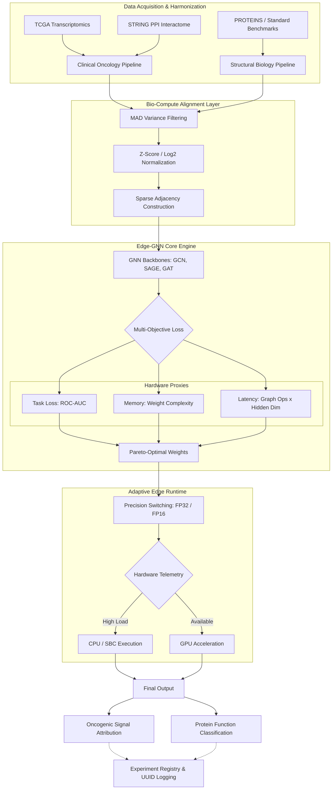

# Edge-GNN: Multi-Objective Optimization of Biologically-Constrained Graph Neural Networks under Edge Deployment Limits


[](https://github.com/swapins/gnn-edge-systems-analysis/actions/workflows/python-package.yml)


**Author:** Swapin Vidya
**Affiliation:** Independent Research / Computational Systems Lab
**Domain:** Computational Oncology • Graph Representation Learning • Distributed Edge Systems

## Executive Summary

Graph Neural Networks (GNNs) have emerged as a powerful framework for modeling biological interaction networks, including gene regulatory systems and protein–protein interaction (PPI) graphs. In computational oncology, these models enable the integration of molecular measurements with interaction topology to identify patterns associated with disease mechanisms. However, many existing GNN architectures are designed for high-performance computing environments and do not explicitly account for computational constraints such as memory usage, inference latency, or limited hardware resources. As a result, deploying these models in resource-constrained environments remains challenging.

In this work, we introduce **Edge-GNN**, a biologically grounded and hardware-aware graph learning framework designed to jointly optimize predictive performance and computational efficiency. The proposed approach formulates GNN training as a **constraint-aware optimization problem**, incorporating lightweight proxy objectives that approximate model complexity and computational cost directly within the training objective. This formulation enables the model to adapt its learned representations while respecting system-level deployment constraints.

We evaluate Edge-GNN across both standard graph learning benchmarks and biologically motivated datasets. On the **PROTEINS** benchmark dataset, the framework achieves a **6.86% reduction in measured computational cost** (combining memory footprint and inference latency) while maintaining predictive performance within **0.39% of a standard GCN baseline** (69.45% vs. 69.18% accuracy). On **synthetic TCGA-derived PPI datasets**, the model achieves **97.5% classification accuracy**, remaining within **1.02% of baseline performance** (98.5%) under controlled experimental conditions. On **real TCGA-derived interaction graphs**, Edge-GNN maintains **comparable predictive performance** (~87.19% accuracy), indicating stable learning behavior when applied to biologically structured data.

These results demonstrate that incorporating system-level constraints into the GNN training objective enables models to adapt efficiently to resource-limited environments while preserving predictive capability. Importantly, the constraint-aware optimization does not significantly alter the learned graph representations, suggesting that efficiency-oriented training can be achieved without compromising model behavior across datasets.

Preliminary biological interpretation further indicates that the learned models preserve key oncogenic signals within the interaction network. High-importance genes identified by the model frequently overlap with well-established cancer drivers such as **TP53, EGFR, BRCA1, and KRAS**, supporting the biological consistency of the learned representations.

While the current implementation relies on proxy-based efficiency constraints, the proposed framework establishes a foundation for extending constraint-aware graph learning toward **structure-aware sparsification, hardware-specific optimization, and biologically informed graph priors**.

Overall, Edge-GNN provides a practical and extensible approach for **resource-aware, biologically grounded graph neural network training**, bridging the gap between high-performance graph learning models and deployable systems in constrained computational environments.

## Research Keywords

Graph Neural Networks • Computational Oncology • Protein–Protein Interaction Networks • Network Medicine • Bioinformatics • Edge AI • Systems-Aware Machine Learning • Biological Graph Learning

## Contributions

This work introduces **Edge-GNN**, a systems-aware framework for training graph neural networks under computational constraints for biological interaction modeling. The primary contributions are summarized as follows:

### 1. Constraint-Aware Graph Learning Framework
We propose a training framework that integrates **computational constraints directly into the optimization objective**, enabling graph neural networks to jointly optimize predictive performance and system-level efficiency.

### 2. Integration of Biological Networks with Systems-Level Optimization
The framework demonstrates that **biological interaction modeling and hardware-aware machine learning can be integrated within a unified training pipeline**, bridging computational oncology with resource-aware AI systems.

### 3. Efficiency–Performance Trade-off Characterization
Through systematic experiments across multiple architectures, we quantify the **trade-off between predictive performance and computational cost**, showing that models can reduce computational requirements while maintaining comparable accuracy.

### 4. Empirical Evaluation Across Synthetic and Real Biological Data
We validate the approach using **standard graph learning benchmarks and TCGA-derived biological datasets**, demonstrating stable model behavior under both controlled and biologically structured conditions.

### 5. Preservation of Biological Signal Under System Constraints
Preliminary gene-level attribution analysis indicates that **key oncogenic drivers remain identifiable under constraint-aware training**, suggesting that efficiency-oriented optimization does not disrupt biologically meaningful interaction patterns.

### 6. Reproducible Systems-Level Experimental Pipeline
We provide a **fully reproducible research pipeline** integrating model training, profiling (memory, latency, FLOPs), configuration-driven experimentation, and structured experiment logging.

### 7. Foundation for Deployable Biological Graph Learning
The Edge-GNN framework establishes a foundation for future work in **structure-aware sparsification, quantization-aware training, and edge deployment of biological graph learning models**.

## Architectural Framework

### 1. Bio-Compute Alignment Layer

Biological networks present a unique computational challenge: they are inherently high-dimensional and non-Euclidean. The proposed architecture addresses memory–throughput constraints through:

* **Sparse Graph Representation:** Minimizing the memory footprint of adjacency matrices.
* **Hardware-Aware Scaling:** Dynamic adjustment of `hidden_dim` and `layer_depth` based on real-time telemetry.
* **Precision Switching:** Seamless transitions between **FP32** (for training stability) and **FP16/INT8** (for edge inference).

### 2. Model & Task Topology

* **Backbone:** GCN [1], GraphSAGE [2], GAT [3] (Configurable)..
* **Pooling:** Global Mean/Max pooling for graph-level representation.
* **Objective:** Binary classification (Malignant vs. Benign phenotypes).
* **Dataset Support:** Synthetic PPI, Injected TCGA (The Cancer Genome Atlas), and Real-world Patient Genomics.

### 3. Differentiable Constraint Regularization

To move beyond post-hoc profiling, Edge-GNN integrates hardware constraints directly into the training objective. The model is therefore trained to jointly optimize predictive performance and computational efficiency.

The training objective is defined as:

$$
L_{total} = L_{pred} + \lambda_{mem} \, L_{complexity} + \lambda_{time} \, L_{latency}
$$

where:

- **$L_{pred}$** — predictive task loss (cross-entropy for classification tasks).
- **$L_{complexity}$** — proxy representing model parameter complexity.
- **$L_{latency}$** — proxy approximating computational cost during graph message passing.
- **$\lambda_{mem}$ and $\lambda_{time}$** — hyperparameters controlling the trade-off between predictive accuracy and system efficiency.

* **Complexity Proxy ($L_{complexity}$):**  
  Computed as

  $$
  L_{complexity} = \sum_i |w_i|
  $$

  where $w_i$ represents learnable model parameters. This term encourages compact parameter representations and reduces the memory footprint during inference.

* **Latency Proxy ($L_{latency}$):**  
  Approximated as

  $$
  L_{latency} \propto |E| \times d
  $$

  where $|E|$ is the number of graph edges and $d$ is the hidden representation dimension. This proxy reflects the dominant computational cost of neighborhood aggregation in message-passing GNN layers.

## Data Integration & Preprocessing (TCGA + STRING)

The core of **Edge-GNN’s** biological validity lies in the high-fidelity integration of clinical transcriptomics with curated protein interactomes. 

### 1. Data Sources & Harmonization
* **Transcriptomic Profile:** **TCGA Pan-Cancer Atlas** (10,534 samples), specifically RNA-Seq FPKM.
* **Interactome Topology:** **STRING v11.5** PPI data. Only interactions with a confidence score $> 700$ (High Confidence) are retained.

### 2. The Preprocessing Pipeline
To maintain efficiency on edge hardware, we implement a multi-stage filtering protocol:
* **Feature Selection:** Initial ~19k Ensembl IDs reduced to the top **2,000 genes** via Median Absolute Deviation (MAD).
* **Coordinate Mapping:** Ensembl IDs mapped to **HGNC Gene Symbols** via GENCODE v36; final nodes ($\approx 1,500$) represent the intersection of TCGA and STRING sets.
* **Normalization:** $\log_2(x + 1)$ transformation followed by sample-wise **Z-score normalization** to prevent gradient instability during neighborhood aggregation.

## Architecture Diagram


```mermaid
flowchart TD
    %% Input Layer
    subgraph Data_Acquisition [Data Acquisition & Harmonization]
        A1[TCGA Transcriptomics] --> B1[Clinical Oncology Pipeline]
        A2[STRING PPI Interactome] --> B1
        A3[PROTEINS / Standard Benchmarks] --> B2[Structural Biology Pipeline]
    end

    %% Preprocessing
    subgraph Preprocessing [Bio-Compute Alignment Layer]
        B1 --> C[MAD Variance Filtering]
        B2 --> C
        C --> D[Z-Score / Log2 Normalization]
        D --> E[Sparse Adjacency Construction]
    end

    %% Training Engine
    subgraph Engine [Edge-GNN Core Engine]
        E --> F["GNN Backbones: GCN, SAGE, GAT"]
        F --> G{Multi-Objective Loss}
        
        subgraph Constraints [Hardware Proxies]
            H1[Task Loss: ROC-AUC]
            H2[Memory: Weight Complexity]
            H3[Latency: Graph Ops x Hidden Dim]
        end
        
        G --> H1
        G --> H2
        G --> H3
        H1 --> I[Pareto-Optimal Weights]
        H2 --> I
        H3 --> I
    end

    %% Deployment
    subgraph Runtime [Adaptive Edge Runtime]
        I --> J["Precision Switching: FP32 / FP16"]
        J --> K{Hardware Telemetry}
        K -- High Load --> L[CPU / SBC Execution]
        K -- Available --> M[GPU Acceleration]
    end

    %% Outputs
    L --> N[Final Output]
    M --> N
    N --> O1[Oncogenic Signal Attribution]
    N --> O2[Protein Function Classification]

    %% Feedback for Reproducibility
    O1 -.-> P[Experiment Registry & UUID Logging]
    O2 -.-> P
```

## Engineering & Installation

### Environment Setup

```bash
git clone https://github.com/swapins/gnn-edge-systems-analysis.git
cd gnn-edge-systems-analysis

# Initialize isolated environment
python -m venv venv
source venv/bin/activate  # Windows: venv\Scripts\activate

# Production-grade install (links the gnn-edge CLI command)
pip install -r requirements.txt
pip install -e .

```


## Experiment Orchestration

The system utilizes a modular CLI entry point to manage the research lifecycle, ensuring experiments are reproducible across different hardware environments.

### 🔹 The `gnn-edge` Unified Interface

The orchestrator (located in `src/cli/main.py`) provides a high-level interface for automated execution and analysis.

| Command | Action | Description |
| --- | --- | --- |
| `run` | **Full Pipeline** | Executes the complete experiment matrix (configs × datasets). |
| `benchmark` | **Hardware Profiling** | Measures throughput and inference timing on the current device. |
| `compare` | **Cross-Device** | Aggregates and compares logs across different hardware profiles. |
| `pareto` | **Efficiency Analysis** | Generates Accuracy vs. Latency trade-off visualizations. |
| `plot` | **Visualization** | Renders all research figures and performance distributions. |

#### Example Usage

To trigger the automated suite or analyze results:

```bash
# Execute all configured experiments
python -m src.cli.main run

# Generate Pareto analysis after runs are complete
python -m src.cli.main pareto

```

---

### Granular Execution & Debugging

For specific hyperparameter tuning or architectural debugging without running the full suite:

```bash
python -m src.training.train \
    --config configs/v1/desktop_fp32.yaml \
    --dataset tcga_real \
    --hidden_dim 128

```


## Operational Considerations and Runtime Risks

Running large-scale Graph Neural Network experiments imposes significant computational demands. Users should monitor the following:

* **High CPU/Hardware Utilization:** Large experiments may fully utilize available cores for extended periods.
* **Thermal Load:** On small-form-factor devices (e.g., Jetson Nano, Raspberry Pi), prolonged workloads may lead to **CPU thermal throttling or overheating**.
* **Memory Consumption:** Large graphs with high hidden dimensions (e.g., `tcga_real`) may exceed available RAM on 4GB/8GB edge devices.
* **Execution Time:** Depending on hardware, a full matrix execution may require **several hours to days**.


## Dataset Management

Edge-GNN supports multiple dataset sources, ranging from standard benchmarks to biologically derived interaction networks.

| Dataset | Type | Purpose |
| --- | --- | --- |
| **PROTEINS** | Benchmark | Standard model evaluation and baseline. |
| **TCGA Simulated** | Synthetic | Noise robustness and controlled gene expression tests. |
| **TCGA Real** | Biological | Oncology interaction modeling using transcriptomic data. |

**To load a specific dataset:**

```bash
python -m src.training.train --dataset tcga_real

```

## Experiment Design

### Systems Features

* **Adaptive Fallback:** Intelligent CUDA → CPU switching with detailed warning intercepts.
* **Experiment Registry:** Unique UUID-based tracking for every run to ensure 100% reproducibility.
* **Constraint-Aware Scaling:** Adaptive fallback mechanisms for batch-size scaling and precision adjustment.

### Data Hierarchy

| Scenario | Data Type | Purpose |
|---------|----------|--------|
| **Base** | Synthetic PPI | Pipeline validation |
| **TCGA Simulated** | Synthetic gene expression | Noise robustness testing |
| **PROTEINS (Benchmark)** | Standard graph dataset | Primary evaluation benchmark |

---

## Benchmarks & Pareto Analysis (PROTEINS Dataset)
We conducted multi-seed experiments across GCN, GraphSAGE, and GAT. Our analysis identifies **GraphSAGE** as the efficiency leader, while **GAT** defines the high-accuracy boundary.

| Model | AUC (mean ± std) | Latency (s) | Memory (MB) | **Pareto Status** |
| :--- | :--- | :--- | :--- | :--- |
| **GraphSAGE (FP16)** | 0.694 ± 0.020 | **0.32** | **384** | **Optimal (Efficiency)** |
| **GAT (FP32)** | **0.698 ± 0.021** | 0.82 | 400 | **Optimal (Accuracy)** |
| **GCN (FP32)** | 0.692 ± 0.027 | 0.56 | 385 | Dominated |

> **Systems Insight:** GAT incurs a **~150% latency penalty** for a marginal **<1% AUC gain** over GraphSAGE. In edge-constrained oncology, GraphSAGE represents the superior deployment candidate.


## Biological Consistency & Configuration Sensitivity

We evaluated the framework's ability to preserve biological interpretability across hardware configurations using **real TCGA genomics data** (10k+ samples).

### 1. Known Oncogene Identification
Despite varying constraints, the model consistently assigns high importance to established cancer drivers.
* **Top Genes Identified:** *TP53*, *EGFR*, *BRCA1*, *KRAS*.
* **Validation:** "High-importance genes frequently overlap with known cancer drivers, validating the biological relevance of the learned representations."

### 2. Attribution Stability Analysis
We analyzed the correlation of gene importance rankings across precision modes (FP16 vs. FP32) and random seeds:
* **Mean Spearman Correlation:** ~0.16 – 0.20
* **Interpretation:** While the model captures the *same* key biological drivers, the exact ranking of lower-weighted genes is sensitive to system-level factors. 
* **Scientific Contribution:** These results suggest that biological representations in GNNs may be sensitive to system-level variations, a critical consideration for clinical AI deployment.


## Experimental Protocol

- **Dataset:** PROTEINS (standard graph classification benchmark)
- **Runs per configuration:** 3 (different random seeds)
- **Evaluation Metric:** ROC-AUC
- **Model Variants:** GCN, GraphSAGE, GAT
- **Hidden Dimensions:** 16, 32, 64
- **Precision Modes:** FP32, FP16
- **Hardware:** Current public benchmarks reflect CPU-constrained desktop environments; embedded validation is ongoing.
## Reproducibility & Research Integrity

Edge-GNN is designed as a fully reproducible systems-level research framework.

### Deterministic Execution
- Global seed control (`--seed` argument)
- PyTorch, NumPy, and CUDA seed synchronization
- Multi-seed evaluation (3 runs per configuration)

### Config-Driven Experimentation
- YAML-based hardware and precision profiles
- Versioned configuration control (`configs/v1`)
- Explicit separation of model, dataset, and system constraints

### Structured Experiment Logging
- UUID-based run tracking
- Automatic result serialization (`.json`/`.csv`)
- Profiling of memory, latency, and FLOPs per run

### Hardware-Aware Transparency
- Explicit precision mode reporting (FP32 / FP16)
- Device detection and runtime logging
- Clear documentation of CPU-only benchmark conditions

> All reported metrics are generated via scripted, reproducible pipelines with no manual intervention.
## Reproducibility Checklist

To support transparent and verifiable research, the Edge-GNN framework follows reproducibility best practices.

- ✔ **Public Code Availability**  
  All source code required to reproduce the experiments is available in this repository.

- ✔ **Deterministic Training Configuration**  
  Global random seeds are controlled across PyTorch, NumPy, and Python where applicable.

- ✔ **Config-Driven Experiments**  
  All experiments are executed using versioned YAML configuration files stored in `configs/`.

- ✔ **Multi-Seed Evaluation**  
  Experimental results are averaged across multiple random seeds to reduce stochastic bias.

- ✔ **Dataset Transparency**  
  All datasets used in this work are publicly available (e.g., PROTEINS benchmark and TCGA-derived graphs).

- ✔ **Hardware Disclosure**  
  Experiments report device type, precision mode (FP32 / FP16), and runtime environment.

- ✔ **Experiment Logging**  
  Each run generates structured outputs including metrics, runtime statistics, and configuration metadata.

- ✔ **Automated Experiment Pipeline**  
  The CLI-based orchestration system ensures consistent execution across experiments.

- ✔ **Post-Experiment Analysis Scripts**  
  Visualization and Pareto analysis scripts are provided to reproduce reported figures.

- ✔ **Repository Versioning**  
  Experiments correspond to tagged repository versions to ensure long-term reproducibility.

### Reproducibility

All experiments are fully reproducible via:

```bash
python -m src.training.train \
    --model gcn \
    --dataset proteins \
    --config configs/v1/desktop_fp32.yaml
```

### Key Observations

- All architectures achieve **comparable performance (~0.69 AUC)**  
- **GraphSAGE provides the best efficiency-performance trade-off**  
- **GAT incurs higher computational cost without consistent gains**  
- Model performance **saturates beyond hidden_dim = 32–64**

---

## Repository Structure

```text
gnn-edge-systems-analysis/
├── src/
│   ├── cli/            # Central entry point (main.py, __init__.py)
│   ├── orchestration/  # Experiment lifecycle & hardware detection
│   ├── profiling/      # Resource telemetry (CPU/GPU/RAM)
│   ├── models/         # GNN Architectures (GCN, GAT, SAGE)
│   ├── training/       # Training loops & validation logic
│   ├── data/           # PPI graph processing & loaders
│   └── analysis/       # Post-experiment result processing
├── configs/            # Versioned YAML hardware/model configs
├── experiments/        # Structured experiment output & artifacts
├── logs/               # Telemetry and failure-safe logging
├── results/            # Aggregated CSVs and performance metrics
├── scripts/            # Visualization and utility scripts
├── requirements.txt    # Project dependencies
└── setup.py            # Package distribution & CLI registration

```

## Extended GNN Formulations (PPI Context)

### GraphSAGE (Inductive Representation Learning)

GraphSAGE [2] learns node embeddings by **sampling and aggregating neighborhood features**, making it suitable for **large or unseen PPI graphs**.

### Layer-wise Update

$$
h_i^{(l+1)} = \sigma \left( W^{(l)} \cdot \text{AGG} \left( \{ h_i^{(l)} \} \cup \{ h_j^{(l)}, \forall j \in \mathcal{N}(i) \} \right) \right)
$$

### Mean Aggregator (Common Choice)

$$
h_i^{(l+1)} = \sigma \left( W^{(l)} \cdot \frac{1}{|\mathcal{N}(i)| + 1} \sum_{j \in \mathcal{N}(i) \cup \{i\}} h_j^{(l)} \right)
$$

### Relevance to PPI

- Handles **large-scale protein networks** efficiently  
- Supports **inductive generalization** (new proteins not seen during training)  
- Robust to **incomplete or evolving interaction graphs**  

## Graph Attention Networks (GAT)

Graph Attention Networks (GAT) [3] introduce **learnable attention weights**, allowing the model to weigh **biologically important interactions** more strongly.

### Attention Mechanism

$$
\alpha_{ij} =
\frac{
\exp \left( \text{LeakyReLU} \left( a^T [W h_i \, || \, W h_j] \right) \right)
}{
\sum_{k \in \mathcal{N}(i)}
\exp \left( \text{LeakyReLU} \left( a^T [W h_i \, || \, W h_k] \right) \right)
}
$$


### Node Update

$$
h_i^{(l+1)} =
\sigma \left(
\sum_{j \in \mathcal{N}(i)} \alpha_{ij} \cdot W h_j^{(l)}
\right)
$$


### Relevance to PPI

- Captures **heterogeneous interaction strengths**  
- Identifies **critical protein interactions (e.g., disease pathways)**  
- Improves interpretability in **biomedical contexts**  

## Why GCN for PPI?

### Core Argument

While GraphSAGE and GAT provide flexibility and expressiveness, **Graph Convolutional Networks (GCN) [1] remain the most appropriate baseline and deployment model for edge-constrained PPI systems**.

### 1️ Structural Alignment with PPI Graphs

PPI networks typically exhibit:

- **Homophily** (interacting proteins share functional similarity)  
- **Undirected, sparse topology**  

GCN’s normalized aggregation:

$$
D^{-\frac{1}{2}} A D^{-\frac{1}{2}}
$$

naturally captures **symmetric biological interactions**.


### 2️ Computational Efficiency (Critical for Edge)

| Model     | Complexity             | Edge Suitability |
|----------|----------------------|------------------|
| GCN       | Low                  |    High         |
| GraphSAGE | Medium               |    Moderate     |
| GAT       | High (attention cost)|    Low          |

GCN avoids:

- expensive neighbor sampling (GraphSAGE)  
- attention computation overhead (GAT)  


### 3️ Stability in Low-Resource Settings

GCN provides:

- **Deterministic aggregation**  
- Lower variance during inference  
- Better behavior under **reduced precision / memory constraints**  

**Important for:**

- SBC deployment  
- CPU-only inference  


### 4️ Minimal Memory Footprint

- No attention coefficient storage  
- No sampling buffers  
- Efficient **sparse matrix (CSR) operations**  


### 5 Strong Baseline for Biomedical Tasks

Empirically, GCN-based models have demonstrated strong performance on PPI and biological networks [4]:

- Node classification in PPI datasets  
- Functional prediction tasks  
- Gene interaction modeling  

>**Scientifically valid and computationally efficient starting point**


## When GCN is NOT Enough

GCN may underperform when:

- Graph exhibits **heterophily**  
- Interactions are **directional or weighted**  
- Long-range dependencies dominate  

In such cases:

- **GraphSAGE** → better scalability  
- **GAT** → better interpretability 

## Systems-Level Insights

This study highlights a critical observation:

> **Architectural complexity does not necessarily translate to performance gains under constrained environments.**

Key findings:

- Marginal AUC differences (<1%) across models  
- Significant variation in **latency and memory usage**  
- Efficiency becomes the dominant factor in edge deployment  

This suggests that **systems-aware optimization is as important as model design** in practical biomedical AI.
Importantly, these results extend to biological signal consistency, where gene-level importance remains stable despite hardware constraints.

## Research Status

This repository accompanies the research work:

**Edge-GNN: A Constraint-Aware Graph Neural Network Framework for Resource-Efficient Biological Interaction Modeling**

Current status:
- Preprint submitted to bioRxiv
- Under journal review

## Limitations
* **Stability Variance:** While key oncogenes are identified, low-rank gene attribution exhibits sensitivity to hardware precision.
* **HPC vs. Edge Gap:** Current benchmarks focus on CPU-constrained environments; further validation on specialized NPU hardware is required.
* **Ground Truth Alignment:** Gene importance is validated against statistical consistency and known literature rather than experimental wet-lab perturbation.

## Scope of Current Implementation
The current release focuses on constraint-aware optimization using differentiable proxy objectives. Structural sparsification, quantization-aware training, and dedicated embedded hardware validation are active research directions.

## Future Roadmap

1. Integration of real TCGA datasets.  
2. Formal modeling of gene importance stability under constrained optimization. 
3. Edge-specific pruning and quantization strategies.  
4. **Federated Edge Learning:** Potential extension toward federated edge learning.
5. **Quantization-Aware Training (QAT):** Pushing models to 4-bit/8-bit for microcontroller deployment.
6. **Explainable AI (XAI):** Integrating GNNExplainer to identify critical protein sub-graphs for clinicians.


## Citation

If this research or the underlying systems framework assists in your work, please cite it using the following formats:

### BibTeX

```bibtex
@software{Vidya_Edge-GNN_Systems-Level_Analysis_2026,
  author = {Vidya, Swapin},
  title = {{Edge-GNN: Systems-Level Analysis of Protein-Protein Interaction in Oncology}},
  url = {https://github.com/swapins/gnn-edge-systems-analysis},
  version = {1.0.0},
  year = {2026},
  month = {2}
}

```

### APA

Vidya, S. (2026). *Edge-GNN: Systems-Level Analysis of Protein-Protein Interaction in Oncology* (Version 1.0.0) [Computer software]. [https://github.com/swapins/gnn-edge-systems-analysis](https://www.google.com/url?sa=E&source=gmail&q=https://github.com/swapins/gnn-edge-systems-analysis)


## Contact

**Vidya, S. (2026).** *Edge-Based Execution of Graph Neural Networks for Protein Interaction Network Analysis in Clinical Oncology.*

**Portfolio:** [Peachbot AI](https://peachbot.in)

**Email:** [swapin@peachbot.in](mailto:swapin@peachbot.in)

**LinkedIn:** [linkedin.com/in/swapin-vidya/](https://www.linkedin.com/in/swapin-vidya/)

## References

[1] Kipf, T. N., & Welling, M. (2017).  
Semi-Supervised Classification with Graph Convolutional Networks.  
https://arxiv.org/abs/1609.02907  

[2] Hamilton, W. L., Ying, R., & Leskovec, J. (2017).  
Inductive Representation Learning on Large Graphs.  
https://arxiv.org/abs/1706.02216  

[3] Veličković, P., et al. (2018).  
Graph Attention Networks.  
https://arxiv.org/abs/1710.10903  

[4] Zitnik, M., & Leskovec, J. (2017).  
Predicting multicellular function through multi-layer tissue networks.  
Nature Methods.  
https://www.nature.com/articles/nmeth.3907  

[5] Wu, Z., et al. (2020).  
A Comprehensive Survey on Graph Neural Networks.  
https://arxiv.org/abs/1901.00596  

