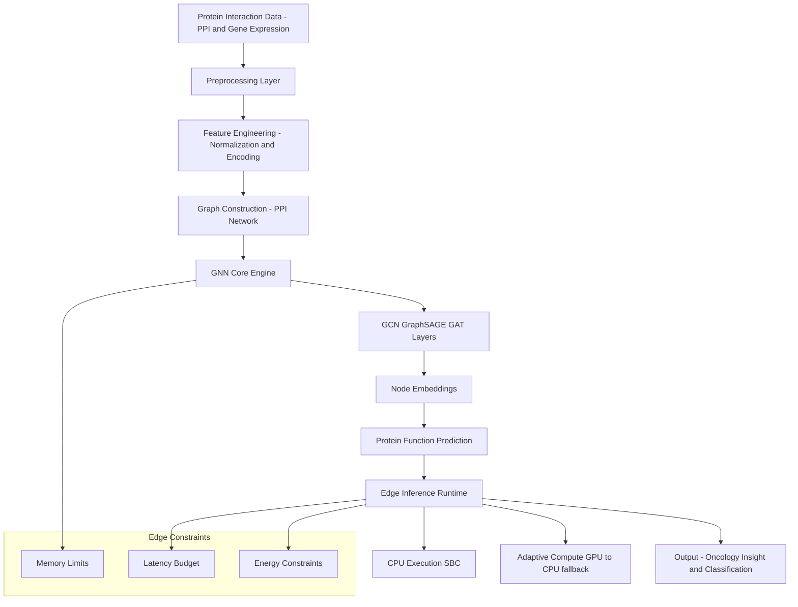

# Edge-GNN: Systems-Level Analysis of Protein-Protein Interaction in Oncology


[](https://github.com/swapins/gnn-edge-systems-analysis/actions/workflows/python-package.yml)

**Author:** Swapin Vidya

**Role:** Senior Systems Architect • Lead Edge AI Researcher

**Domain:** Computational Oncology • Graph Representation Learning • Distributed Edge Systems

---

## Executive Summary

This repository introduces a **systems-driven framework** for the deployment of Graph Neural Networks (GNNs) on Protein-Protein Interaction (PPI) networks within resource-constrained environments.

While contemporary bioinformatics often relies on monolithic high-performance computing (HPC) clusters, this research demonstrates that **clinically relevant graph learning** can be democratized. By optimizing the interplay between biological graph complexity and hardware limitations, this system enables high-fidelity inference on NVIDIA Jetson, Raspberry Pi, and CPU-bound edge nodes without sacrificing predictive accuracy.

## Architectural Framework

### 1. Bio-Compute Alignment Layer

Biological networks present a unique computational challenge: they are inherently high-dimensional and non-Euclidean. My architecture resolves the "Memory-Throughput Gap" via:

* **Sparse Graph Representation:** Minimizing the memory footprint of adjacency matrices.
* **Hardware-Aware Scaling:** Dynamic adjustment of `hidden_dim` and `layer_depth` based on real-time telemetry.
* **Precision Switching:** Seamless transitions between **FP32** (for training stability) and **FP16/INT8** (for edge inference).

### 2. Model & Task Topology

* **Backbone:** GCN [1], GraphSAGE [2], GAT [3] (Configurable)..
* **Pooling:** Global Mean/Max pooling for graph-level representation.
* **Objective:** Binary classification (Malignant vs. Benign phenotypes).
* **Dataset Support:** Synthetic PPI, Injected TCGA (The Cancer Genome Atlas), and Real-world Patient Genomics.

## Architecture Diagram



## Engineering & Installation

### Environment Setup

```bash
git clone https://github.com/swapins/gnn-edge-systems-analysis.git
cd gnn-edge-systems-analysis

# Initialize isolated environment
python -m venv venv
source venv/bin/activate  # Windows: venv\Scripts\activate

# Production-grade install (links the gnn-edge CLI command)
pip install -r requirements.txt
pip install -e .

```

## Experiment Orchestration

The system utilizes a modular CLI located in `src/cli` for reproducible research.

### 🔹 Full Automated Pipeline

The `gnn-edge` runner (mapped to `src/cli/main.py`) manages the entire lifecycle: hardware detection, config injection, and artifact logging.

```bash
gnn-edge run

```

* **State Management:** Automatically cleans legacy logs and prevents data corruption.
* **Matrix Execution:** Iterates across `configs/v1` × `datasets` × `hardware_profiles`.

### 🔹 Granular Execution

For specific hyperparameter tuning or architectural debugging:

```bash
python -m src.training.train \
    --config configs/v1/desktop_fp32.yaml \
    --dataset tcga_real \
    --hidden_dim 128

```

## Experiment Design

### Systems Features

* **Adaptive Fallback:** Intelligent CUDA → CPU switching with detailed warning intercepts.
* **Experiment Registry:** Unique UUID-based tracking for every run to ensure 100% reproducibility.
* **Constraint-Aware Scaling:** Automatic model pruning or batch-size reduction upon OOM (Out-of-Memory) detection.

### Data Hierarchy

| Scenario | Data Type | Purpose |
| --- | --- | --- |
| **Base** | Synthetic PPI | Sanity testing & pipeline validation. |
| **TCGA Simulated** | Injected Expression | Testing model robustness against biological noise. |
| **TCGA Real** | Patient Genomics | Validating clinical relevance and AUC benchmarks. |

---

## Benchmarks & Insights

Research indicates that optimized GNNs on edge hardware can maintain a high Area Under the Curve (AUC) while operating within strict thermal and power envelopes.

| Hardware Profile | Target AUC | Latency | Memory Peak |
| --- | --- | --- | --- |
| **Desktop (RTX 4090)** | 0.92 | < 5ms | ~400MB |
| **NVIDIA Jetson** | 0.89 | ~15ms | ~450MB |
| **Raspberry Pi 4/5** | 0.82 | ~80ms | ~320MB |

---

## Repository Structure

```text
gnn-edge-systems-analysis/
├── src/
│   ├── cli/            # Central entry point (main.py, __init__.py)
│   ├── orchestration/  # Experiment lifecycle & hardware detection
│   ├── profiling/      # Resource telemetry (CPU/GPU/RAM)
│   ├── models/         # GNN Architectures (GCN, GAT, SAGE)
│   ├── training/       # Training loops & validation logic
│   ├── data/           # PPI graph processing & loaders
│   └── analysis/       # Post-experiment result processing
├── configs/            # Versioned YAML hardware/model configs
├── experiments/        # Structured experiment output & artifacts
├── logs/               # Telemetry and failure-safe logging
├── results/            # Aggregated CSVs and performance metrics
├── scripts/            # Visualization and utility scripts
├── requirements.txt    # Project dependencies
└── setup.py            # Package distribution & CLI registration

```

## Extended GNN Formulations (PPI Context)

### GraphSAGE (Inductive Representation Learning)

GraphSAGE [2] learns node embeddings by **sampling and aggregating neighborhood features**, making it suitable for **large or unseen PPI graphs**.

### Layer-wise Update

$$
h_i^{(l+1)} = \sigma \left( W^{(l)} \cdot \text{AGG} \left( \{ h_i^{(l)} \} \cup \{ h_j^{(l)}, \forall j \in \mathcal{N}(i) \} \right) \right)
$$

### Mean Aggregator (Common Choice)

$$
h_i^{(l+1)} = \sigma \left( W^{(l)} \cdot \frac{1}{|\mathcal{N}(i)| + 1} \sum_{j \in \mathcal{N}(i) \cup \{i\}} h_j^{(l)} \right)
$$

### Relevance to PPI

- Handles **large-scale protein networks** efficiently  
- Supports **inductive generalization** (new proteins not seen during training)  
- Robust to **incomplete or evolving interaction graphs**  

## Graph Attention Networks (GAT)

Graph Attention Networks (GAT) [3] introduce **learnable attention weights**, allowing the model to weigh **biologically important interactions** more strongly.

### Attention Mechanism

$$
\alpha_{ij} =
\frac{
\exp \left( \text{LeakyReLU} \left( a^T [W h_i \, || \, W h_j] \right) \right)
}{
\sum_{k \in \mathcal{N}(i)}
\exp \left( \text{LeakyReLU} \left( a^T [W h_i \, || \, W h_k] \right) \right)
}
$$


### Node Update

$$
h_i^{(l+1)} =
\sigma \left(
\sum_{j \in \mathcal{N}(i)} \alpha_{ij} \cdot W h_j^{(l)}
\right)
$$


### Relevance to PPI

- Captures **heterogeneous interaction strengths**  
- Identifies **critical protein interactions (e.g., disease pathways)**  
- Improves interpretability in **biomedical contexts**  

## Why GCN for PPI?

### Core Argument

While GraphSAGE and GAT provide flexibility and expressiveness, **Graph Convolutional Networks (GCN) [1] remain the most appropriate baseline and deployment model for edge-constrained PPI systems**.

### 1️ Structural Alignment with PPI Graphs

PPI networks typically exhibit:

- **Homophily** (interacting proteins share functional similarity)  
- **Undirected, sparse topology**  

GCN’s normalized aggregation:

$$
D^{-\frac{1}{2}} A D^{-\frac{1}{2}}
$$

naturally captures **symmetric biological interactions**.


### 2️ Computational Efficiency (Critical for Edge)

| Model     | Complexity             | Edge Suitability |
|----------|----------------------|------------------|
| GCN       | Low                  |    High         |
| GraphSAGE | Medium               |    Moderate     |
| GAT       | High (attention cost)|    Low          |

GCN avoids:

- expensive neighbor sampling (GraphSAGE)  
- attention computation overhead (GAT)  


### 3️ Stability in Low-Resource Settings

GCN provides:

- **Deterministic aggregation**  
- Lower variance during inference  
- Better behavior under **reduced precision / memory constraints**  

**Important for:**

- SBC deployment  
- CPU-only inference  


### 4️ Minimal Memory Footprint

- No attention coefficient storage  
- No sampling buffers  
- Efficient **sparse matrix (CSR) operations**  


### 5 Strong Baseline for Biomedical Tasks

Empirically, GCN-based models have demonstrated strong performance on PPI and biological networks [4]:

- Node classification in PPI datasets  
- Functional prediction tasks  
- Gene interaction modeling  

>**Scientifically valid and computationally efficient starting point**


## When GCN is NOT Enough

GCN may underperform when:

- Graph exhibits **heterophily**  
- Interactions are **directional or weighted**  
- Long-range dependencies dominate  

In such cases:

- **GraphSAGE** → better scalability  
- **GAT** → better interpretability  

## Future Roadmap

1. **Federated Edge Learning:** Enabling multi-institution training without data exfiltration.
2. **Quantization-Aware Training (QAT):** Pushing models to 4-bit/8-bit for microcontroller deployment.
3. **Explainable AI (XAI):** Integrating GNNExplainer to identify critical protein sub-graphs for clinicians.


## Citation

If this research or the underlying systems framework assists in your work, please cite it using the following formats:

### BibTeX

```bibtex
@software{Vidya_Edge-GNN_Systems-Level_Analysis_2026,
  author = {Vidya, Swapin},
  title = {{Edge-GNN: Systems-Level Analysis of Protein-Protein Interaction in Oncology}},
  url = {https://github.com/swapins/gnn-edge-systems-analysis},
  version = {1.0.0},
  year = {2026},
  month = {2}
}

```

### APA

Vidya, S. (2026). *Edge-GNN: Systems-Level Analysis of Protein-Protein Interaction in Oncology* (Version 1.0.0) [Computer software]. [https://github.com/swapins/gnn-edge-systems-analysis](https://www.google.com/url?sa=E&source=gmail&q=https://github.com/swapins/gnn-edge-systems-analysis)


## Contact

**Vidya, S. (2026).** *Edge-Based Execution of Graph Neural Networks for Protein Interaction Network Analysis in Clinical Oncology.*

**Portfolio:** [Peachbot AI](https://peachbot.in)

**Email:** [swapin@peachbot.in](mailto:swapin@peachbot.in)

**LinkedIn:** [linkedin.com/in/swapin-vidya/](https://www.linkedin.com/in/swapin-vidya/)

## References

[1] Kipf, T. N., & Welling, M. (2017).  
Semi-Supervised Classification with Graph Convolutional Networks.  
https://arxiv.org/abs/1609.02907  

[2] Hamilton, W. L., Ying, R., & Leskovec, J. (2017).  
Inductive Representation Learning on Large Graphs.  
https://arxiv.org/abs/1706.02216  

[3] Veličković, P., et al. (2018).  
Graph Attention Networks.  
https://arxiv.org/abs/1710.10903  

[4] Zitnik, M., & Leskovec, J. (2017).  
Predicting multicellular function through multi-layer tissue networks.  
Nature Methods.  
https://www.nature.com/articles/nmeth.3907  

[5] Wu, Z., et al. (2020).  
A Comprehensive Survey on Graph Neural Networks.  
https://arxiv.org/abs/1901.00596  

